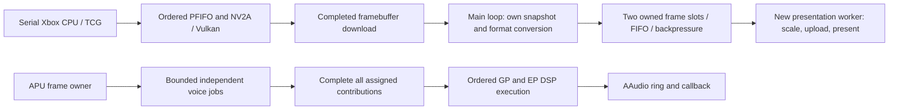
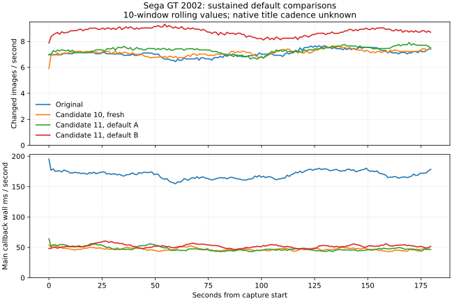
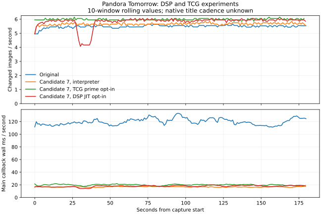
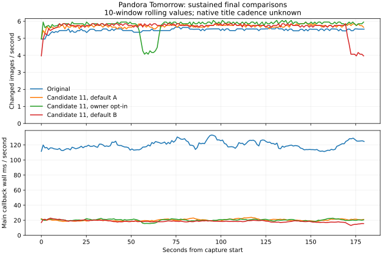

# Snapdragon 865 performance work

Measured on 8 October 2026, branch `deep-optimization`. Xemu baseline:
`478b4f496102379c7eaa7f3ec10e714a703c4300`; DSP56300:
`bde7c233a447d32d558c48cb4438e1425fe0bbcc`. Device: Retroid Pocket 5,
Snapdragon 865 / Adreno 650, Android 13/API 33. Benchmarks and exact APK/shared
library versions are archived locally under `build/performance/deep-optimization`.
Compact results accompany this report in `snapdragon-865-results.json`.

## Architecture and ordering

The baseline already has a serial guest TCG CPU thread, an NV2A PFIFO thread,
an APU/DSP thread, eight voice workers, and Android audio callbacks. It did
**not** execute all useful work on one Cortex A77 core. The measured process
has access to CPUs 0–7 and uses several performance cores.



### New concurrent work

- `boxdroid-wsi` owns CPU scaling, persistent Vulkan staging and Android
  presentation. It consumes immutable host-owned pixel copies, never guest RAM,
  the QEMU BQL or guest device state. The main loop can resume while it presents.
- Two reusable slots include the active frame. Producers wait on a full queue.
  Live surfaces retain FIFO order; no frame skipping or queue overwrite is used.
- Surface retirement wakes producers, finishes or cancels obsolete surface work,
  joins the worker, then destroys Vulkan/window resources. Mode comparisons
  drain the queue before switching. Worker startup failure uses synchronous
  presentation.
- Existing voice workers are improved instead of duplicated. Only assigned
  workers wake. Multipass source/destination cohorts remain together and retain
  guest list order. The APU waits for all assigned contributions before mixing
  proceeds to DSP processing. Exit releases the dispatcher mutex; all workers
  join before synchronization primitives are destroyed.
- The default pool is the discovered performance-core count, capped at four and
  clamped to allowed CPUs. Unknown topology falls back to at most two. Android's
  scheduler chooses audio worker placement. This count was selected for audio continuity;
  the pool experiment did not establish an FPS gain from using more threads.
- TCG uses Android's scheduler by default. An opt-in comparison can place it on
  the single allowed core with the highest reported capacity. Selection requires
  a distinct peak, another performance core, and a meaningful capacity gap.
  Unknown, homogeneous or restricted topologies and affinity errors retain
  scheduler placement. The hook runs once before guest execution, changes no
  priority, and leaves other workers' masks alone. Cross-title audio results
  below rule out making this a universal default.
- An additional opt-in path lets the APU owner process voice cohort zero while
  three background workers process the other cohorts. The four original cohorts
  and completed-mix barrier remain intact. This removes one background thread;
  Sega GT's repeat comparison does not support enabling it universally.

GPU readback keeps its original barriers and queue completion before CPU access.
Only the completed image range is invalidated. Download staging begins at 2 MiB
and grows in 2 MiB increments up to the original 64 MiB limit; growth waits for
the queue before replacement. Upload and compute buffers retain their capacities.
The presenter retains queue completion before reusing its mapped staging memory.

The guest instruction stream, interrupts, GPU fences, audio clocks and original
GP/EP ordering are unchanged. There is no guest CPU splitting, speculative guest
execution, frame-rate cap change or frame skipping.

## Device and measurement method

| Online CPUs | Reported capacity | Frequency-policy maximum |
| --- | ---: | ---: |
| 0–3 / Cortex A55 | 351 | 1.8048 GHz |
| 4–6 / Cortex A77 | 871 | 2.4192 GHz |
| 7 / prime Cortex A77 | 1024 | 2.8416 GHz |

These IDs describe this measured device; implementation discovers topology and
allowed masks at runtime. Every original native affinity mask was `ff` (0–7).
The app was in the top-app cpuset, governors were `schedutil`, and the user held
performance mode and cooling fixed. Resolution scale was one, renderer Vulkan,
host surface 1920×1080 with aspect-fit scaling. Sega GT used the same stationary
Mustang GT, third-person camera, race/track. Other cars continue racing, so the
scene is repeatable but not deterministic.
Pandora Tomorrow used the first playable opening bridge, with Sam and the
third-person camera stationary. Ambient animations continue during captures.

Measurements use non-root ADB, `/proc/<pid>/task/*/schedstat` and `stat`,
frequency/RSS/thermal snapshots, opt-in timestamped frame logs, and simpleperf
500 Hz CPU-clock sampling with call stacks. Schedstat CPU percentages are fractions
of one logical CPU. Sampled CPU IDs are observations, **not** residency estimates.
Native reports are resolved against the exact archived unstripped library.
The script requests a one-second wait after each ADB snapshot; query overhead
makes representative capture spacing approximately 1.6–1.8 seconds. Actual
minimum/median/maximum spacing is recorded for each capture.
Kernel symbol addresses are restricted; unknown kernel work cannot be attributed
precisely. Available captures reported zero lost simpleperf samples.
Final captures also read the app UID's `/proc/<pid>/io` counters at both endpoints
without root. `rchar`/`wchar` include cached reads, sockets and logging; they are
different from storage-accounted `read_bytes`/`write_bytes`. A zero storage-byte
delta does not prove that guest storage made no requests or incurred no wait.
Earlier captures lack these counters and retain unknown storage accounting.

Cadences are recorded separately:

| Quantity | Meaning |
| --- | --- |
| Guest flips | Guest framebuffer-flip notifications per host second |
| Unique images | Changes in the full scanout-image fingerprint; static images can undercount game frames |
| Display refresh callbacks | QEMU display callbacks, not physical scanout, guest VBlank or game speed |
| Guest video mode | The existing guest AvSetDisplayMode observer, separate from callback counts |
| Completed presentation | Successful host Vulkan presents, including repeated images |
| Native title cadence | Unknown unless backed by title/version/region/mode evidence |
| Emulation speed | Unknown without a validated guest-time/work-progress reference |

The Sega GT image filename identifies a Europe multilingual release. The
observed display refresh callbacks are approximately 60/s; filename region alone is not
proof of PAL mode or a 25/30/50/60 FPS gameplay target. No title target has been
invented. QEMU's host-paced virtual timers without instruction counting are not
a reliable standalone 100% guest-speed measurement.

## Results and decisions

### Selected normal configuration

Candidate 11 is installed on the Retroid. Normal play uses asynchronous
presentation, four background voice workers discovered from the allowed
topology, Android's default scheduler, the DSP interpreter, and disabled
high-volume diagnostics/profiling. Owner participation, TCG-only placement and
DSP JIT remain explicit experiments.

The following values use the healthy original and first Candidate 11 normal
180-second capture for each scene:

| Scene | Original changed images/s | Candidate 11 changed images/s | Main callback wall-cost reduction | Missing audio frames, original → candidate |
| --- | ---: | ---: | ---: | ---: |
| Sega GT, stationary race | 7.10 | 7.36 | 72.0% | 31.66% → 25.03% |
| Pandora, opening bridge | 5.50 | 5.72 | 83.1% | 8.98% → 4.83% |

These are modest 3–4% cadence differences, with substantial scene/soak variation.
The fresh Candidate 10 Sega GT run reached only 7.15/s; later Candidate 11 normal
phases reach 8.75/s without a code change. None establishes a large isolated
multithreading FPS speedup. Pandora's Candidate 11 capture also starts cooler
than the original: CPU peak 72.9 versus 79.9 °C and battery 26.2 versus 34.7 °C
at the start, despite matching sampled performance-core frequencies.
Reduced main-loop blocking, useful concurrent presentation and better audio
continuity are measured improvements. Native title targets and 100% guest speed
remain unverified; neither is inferred from changed-image counts.

### Early captures and presentation isolation

| Capture | Unique images/s | Main callback wall ms/s | Audio state |
| --- | ---: | ---: | --- |
| Original, early 60 s | 5.45 | 181.85 | Disconnected, error −899 |
| Candidate 1, 8 voices | 7.34 | 103.82 | Active, underruns |
| Candidate 2 async A, 2 voices | 7.32 | 43.54 | Active, underruns |
| Candidate 2 synchronous, 2 voices | 7.81 | 79.51 | Active, underruns |
| Candidate 2 async B, 2 voices | 8.72 | 49.05 | Active, underruns |

The original early baseline's prime-core median was 1.5168 GHz, whereas the
candidates' was 2.8416 GHz. Its audio stream was disconnected. Consequently,
**5.45→8.72 is not a controlled speedup claim**. Fresh sustained comparisons
are required and recorded separately below. Failed/overlapping early captures
`sega-race-baseline-1` and `-2` are excluded entirely.

Within the same running Candidate 2 race, asynchronous presentation reduced
main-loop callback wall cost from 79.51 to 43.54–49.05 ms/s (38–45%). Completed
host presents were approximately twice the unique-image cadence: these repeated
images are not additional game FPS. All three phases reported zero failed
presents, zero canceled queued frames, zero producer blocking, and bounded depth
two. Async service p95 was 3.00–3.29 ms; queue wait p95 was 59–70 μs. The FPS
variation does not establish a repeatable isolated asynchronous-presentation
speedup. Useful concurrent presentation and reduced main-loop blocking are
measured outcomes.

Candidate 1→2 lowered scanout wall cost from 26.11 to 6.45 ms/s and conversion/
fingerprinting from 36.03 to 5.55 ms/s. PFIFO syscall/cache-maintenance sample
share fell from approximately 8.46% to 0.99% of total CPU-clock samples,
consistent with the smaller download allocation. Candidate 2 bundles several
changes; these are cost observations, not an isolated per-patch FPS attribution.
Normal gameplay also disables expensive VRAM/TB/x87 diagnostics and per-frame
success logs. Detailed diagnostics remain opt-in; essential video-mode discovery
and the changed-image counter remain active.

### Audio pool, same running Candidate 3 race

Each phase was 60 s after a five-second settling period, in order 2→4→8→4→2.
Underrun fraction uses missing audio frames divided by requested callback frames
across the available audio-counter window, which is shorter than the capture.

| Workers / phase | Unique images/s | Unique interval p95, ms | Missing audio frames |
| --- | ---: | ---: | ---: |
| 2 / A | 6.85 | 200.2 | 25.64% |
| 4 / A | 7.49 | 183.3 | 22.26% |
| 8 / A | 7.42 | 181.8 | 23.81% |
| 4 / B | 7.88 | 183.3 | 22.54% |
| 2 / B | 8.57 | 166.7 | 24.67% |

Four workers improved audio continuity compared with both two-worker phases;
eight did not improve FPS and had more missing audio than four. Two/four mean
FPS are effectively equal amid scene/warmup variation. The four-worker default
is bounded and supported by audio measurements, not a core-count throughput
claim. Underruns remain substantial with the interpreter.

### Scheduling experiment

Temporary capacity-derived placement put TCG on the prime core, the two voice
workers and APU on separate performance cores, and presentation on efficiency
cores. That phase reached 9.73 unique images/s versus 8.72 and 8.48 in the
bracketing default-scheduler phases. However, audio underruns increased and
presentation service p95 rose from about 3 to 10 ms. APU scheduler wait grew
from about 1.6 to 5.7 seconds per 60-second capture. This policy is not selected.
Every original mask was restored. CPU IDs are discovered, and no priority
change is made. A subsequent experiment isolates TCG placement and leaves all
other workers unrestricted.

In Pandora's same running scene, interpreter/scheduler phases reached 5.66 and
5.68 images/s before TCG-only placement, and 5.44 after restoring the mask.
TCG-only prime placement reached 5.99 images/s over 180 seconds, with interval
p95 falling from approximately 256 to 224 ms. Missing audio frames fell from
4.59–4.76% to 3.00%. Median prime and other performance-core frequencies stayed
at 2.8416 and 2.4192 GHz. The Sega GT comparison prevents selecting this as a
universal policy. Both placement approaches remain opt-in experiments.

Candidate 9 tested TCG-only placement across three successive 180-second Sega
GT captures, with ten-second settling intervals and the same running race:

| TCG placement / phase | Changed images/s | Unique interval p95, ms | Missing audio frames |
| --- | ---: | ---: | ---: |
| Prime / A | 7.57 | 183.1 | 25.49% |
| Scheduler | 8.76 | 166.5 | 22.71% |
| Prime / B | 9.09 | 153.1 | 26.24% |

The cadence improves with time, so this does not isolate an FPS gain from
placement. Both prime phases have more missing audio frames than the middle
scheduler phase. Candidate 10 therefore uses the scheduler by default, while
retaining the explicit capacity-derived experiment control. The candidate's
presentation, fingerprinting, readback and voice-pool changes remain enabled.

### APU owner participation

Candidate 11 compared `voice_apu=0→1→0→1` in the same running Sega GT race.
Each phase lasted 180 seconds after ten seconds of settling. TCG placement
remained scheduler-default, and the DSP interpreter and four voice cohorts
were used throughout.

| Phase | Background workers | Changed images/s | Unique interval p95, ms | Missing audio frames | Background wakeups/s |
| --- | ---: | ---: | ---: | ---: | ---: |
| Off / A | 4 | 7.36 | 185.4 | 25.03% | 4,501 |
| On / A | 3 | 8.61 | 166.3 | 18.73% | 3,650 |
| Off / B | 4 | 8.75 | 164.8 | 24.44% | 4,534 |
| On / B | 3 | 8.57 | 166.8 | 24.42% | 3,397 |

The first enabled phase improved audio and cadence, but the repeat did not
reproduce that advantage. Background wakeups fell consistently, while second-pair
VP wall cost per 32-sample frame changed only from 0.584 to 0.575 ms. EP work-budget
overruns increased from 65.34% to 68.12% in that pair. Fewer wakeups and a busy
APU participant are not sufficient evidence of a gameplay speedup. The mode
remains opt-in, with `voice_apu=0` as the default.

All four phases completed every queued presentation without failure, cancellation
or producer blocking. Prime and other performance-core frequencies remained at
2.8416 and 2.4192 GHz in the periodic samples. Peak observed CPU temperatures
were 76.4–80.6 °C. The enabled APU thread used 50–69% of one CPU while three voice
threads processed the other cohorts concurrently. This demonstrates useful owner
participation, but the measurements do not justify a universal default or an
isolated FPS gain.

Pandora's same-process Candidate 11 comparison used three 180-second phases:

| Phase | Changed images/s | Unique interval p95, ms | Missing audio frames | Background wakeups/s | VP wall μs per 32-sample frame |
| --- | ---: | ---: | ---: | ---: | ---: |
| Off / A | 5.72 | 256.1 | 4.83% | 5,705 | 202.4 |
| On | 5.79 | 254.1 | 3.61% | 4,332 | 178.0 |
| Off / B | 5.66 | 256.0 | 4.81% | 5,707 | 202.7 |

Owner participation reduced voice-processing wall cost per frame by about 12%
and missing audio by about 1.2 percentage points against both normal brackets.
EP work-budget overruns were 16.46%→14.68%→16.83%. Cadence changed only 1–2%.
This supports the experiment for this Pandora scene; Sega GT's failed repeat
still rules out enabling it universally. Contribution-mutex wait/hold rose from
7.11/5.85 to 10.24/6.04 ms/s, and APU CPU time rose from 53.4% to 56.3% of one
CPU as it processed its assigned cohort. All three phases retain successful,
ordered presents without failure, cancellation or producer blocking.

Frame pacing is mixed. The on phase has a 2.992-second changed-image gap around
55 seconds, and the second off phase has a 3.152-second gap around 171 seconds;
the first off phase's maximum is 289 ms. Percentile p99 remains about 272 ms and
hides these isolated events. During the long gaps, guest flips stop while display
callbacks and APU processing continue. TCG remains busy, PFIFO/WSI CPU work falls
idle, and maximum WSI service/queue delays are only 9–11/4 ms. This points to work
upstream of presentation; the exact guest/core cause is unknown. No general frame
pacing improvement is claimed. The profiler now records maximum intervals and
the number of changed-image gaps exceeding one second.

The Pandora process recorded 12.92, 22.45 and 1.11 MiB of `read_bytes` over its
approximately 182-second counter windows; `write_bytes` remained zero. These
are process totals, not isolated guest-drive latency measurements. Original-build
I/O counters are unavailable, so no storage speedup is claimed. Peak sampled CPU
temperatures rose 72.9→74.4→76.0 °C over the nine-minute comparison. The prime
median stayed at 2.8416 GHz and other performance-core medians at 2.4192 GHz;
one on-phase sample dipped to 2.2464 GHz on the latter policy.

### Sustained title comparisons

The healthy original-build and Candidate 10 Sega GT captures both ran for 180
seconds with working audio, scheduler placement and the same stationary scene:

| Build | Changed images/s | Main callback wall ms/s | Missing audio frames | Ending RSS, MiB |
| --- | ---: | ---: | ---: | ---: |
| Original, eight voice workers | 7.10 | 169.78 | 31.66% | 654.71 |
| Candidate 10, four voice workers | 7.15 | 47.01 | 22.82% | 617.75 |

Main callback wall cost fell 72.3%, and missing audio frames fell by 8.84 percentage
points. Changed-image cadence increased only 0.75%; this is not a meaningful FPS
speedup claim. The candidate combines presentation, fingerprinting, readback,
diagnostic gating and voice-pool changes, so the comparison cannot attribute the
whole result to multithreading alone. The prime-core median was 2.8416 GHz in both
captures. Candidate 11 retains those defaults and adds the opt-in APU comparison;
its Sega GT results above show the size of same-scene variation rather than a
repeatable 20–28% improvement. The full per-capture values and controls are
retained in the accompanying JSON.



Pandora's healthy original and candidate captures lasted 180 seconds each:

| Build / DSP / TCG placement | Changed images/s | Main callback wall ms/s | Missing audio frames |
| --- | ---: | ---: | ---: |
| Original / interpreter / scheduler | 5.50 | 120.21 | 8.98% |
| Candidate 7 / interpreter / scheduler | 5.66 | 16.83 | 4.76% |
| Candidate 11 / interpreter / scheduler / owner off A | 5.72 | 20.29 | 4.83% |
| Candidate 7 / interpreter / prime | 5.99 | 19.85 | 3.00% |
| Candidate 7 / experimental JIT / scheduler | 5.82 | 17.94 | 2.77% |

The interpreter candidate reduces main callback wall cost by 83–86%; its
changed-image improvement is modest (3–4% with scheduler placement, 9% with
TCG-only placement). These are scene observations, not proof of native FPS or
100% guest speed. The JIT phase reduces measured DSP wall work from 474 to
366 ms/s (23%), but changed-image cadence improves only about 3% against both
interpreter/scheduler phases. The interpreter remains the normal-play default;
state/audio equivalence to the C backend needs separate validation.
The JIT phase also has a temporary cadence dip around 30–40 seconds; a higher
mean is not sufficient evidence of improved frame pacing.



Pandora's interpreter candidate uses TCG at 82% of one CPU, APU at 53%, PFIFO
at 11%, four voice workers at approximately 5.5/4.9/4.3/3.5%, main at 5.4%, and
the new WSI worker at 2.9%. WSI successfully completes 11.33 host presents/s,
including repeats of approximately 5.66 changed images/s. Queue service p95
is 3.36 ms and queue wait p95 is 56 μs; no failed/canceled frames or producer
blocking occur in that capture. This establishes useful presentation work
concurrent with the existing emulator threads, without a core-count speedup
claim.

The four Pandora voice workers collectively wait approximately 3.86 worker
seconds per host second, do 114 ms/s of processing wall work, and wake around
5,712 times/s. Queue peaks are 11 jobs total and three per worker. Dispatcher
barrier wall time is 280 ms/s; contribution-mutex wait/hold are 7.2/5.9 ms/s.
EP work-budget overruns occur in 16.5% of interpreter batches and 13.2% with
the experimental JIT. Idle/wait wall time includes preemption and mutex
reacquisition; it cannot be interpreted as CPU use. These measurements favor
reducing dispatch overhead and balancing verified independent cohorts before
adding further workers.



## Profiling and reproducing

```sh
# Set before launching the game. High-volume diagnostics stay off.
adb shell setprop debug.boxdroid.profile 1
adb shell setprop debug.boxdroid.diagnostics 0
adb shell setprop debug.boxdroid.async_present 1
adb shell setprop debug.boxdroid.voice_workers 4
adb shell setprop debug.boxdroid.voice_apu 0
adb shell setprop debug.boxdroid.dsp_jit 0
adb shell "setprop debug.boxdroid.tcg_prime ''"
BOXDROID_INSTALL=0 ./scripts/build-android.sh
adb install -r android/app/build/outputs/apk/debug/app-debug.apk
# Launch the selected game and reproduce the scene, then:
python3 scripts/profile-android.py title-scene-baseline --duration 180 --perf \
  --note 'Record APK SHA256, title/version/region, scene/camera, renderer, scale and cooling'
```

The capture records the installed APK's SHA256 automatically. Resolve native
samples using the saved unstripped library from that exact build, for example:

```sh
python3 scripts/report-android-profile.py \
  build/performance/deep-optimization/pandora-mission-candidate-11-dispatch-off-a \
  --library build/performance/deep-optimization/candidate-11-libboxdroid.so
```

With profiling enabled, `async_present`, `voice_workers` and `voice_apu` can be changed in
one running scene. Presentation mode changes drain first; audio pool changes
join idle workers at the APU frame boundary. Allow settling before measuring.
`voice_apu=1` includes the APU owner in the configured number of voice cohorts:
four means three background workers and the owner; one means owner-only work.
This control can also be selected at startup without profiling. Its normal
default is zero, preserving the measured four-background-worker configuration.
`dsp_jit=1` compares the existing upstream Cranelift backend with the interpreter,
using upstream state export/import at the APU-owned boundary. This is experimental
and only available with profiling enabled; normal gameplay uses the interpreter.
Game-level correctness needs separate validation before promoting that backend.

`tcg_prime` is read once when TCG starts: an empty property or `0` selects
Android's scheduler, and `1` opts into capacity-derived prime placement.
The same-process scheduling comparisons
use `adb shell run-as org.boxdroid taskset -p <mask> <TCG-tid>` and restore the
original mask in a `finally` block. Saved thread masks accompany each capture.

`VOICE_PROFILE` records voice/job queue peaks, wake counts, processing wall time,
contribution-mutex wait/hold time, condition wait and dispatcher barrier wait.
Condition wait includes mutex reacquisition and worker work includes preemption;
use `/proc` CPU time separately. `APU_PROFILE` splits VP, DSP and monitor wall
work. An EP budget overrun means work for eight 32-sample frames exceeded the
existing 5,333 μs work budget; it is distinct from an AAudio callback underrun.
AAudio counter differences measure actual missing/offered/consumed/dropped frames.
Production minus consumption is ring inventory change, not proven clock drift.

To return to normal logging and the discovered worker default:

```sh
adb shell setprop debug.boxdroid.profile 0
adb shell setprop debug.boxdroid.diagnostics 0
adb shell setprop debug.boxdroid.dsp_jit 0
adb shell setprop debug.boxdroid.async_present 1
adb shell "setprop debug.boxdroid.voice_workers ''"
adb shell setprop debug.boxdroid.voice_apu 0
adb shell "setprop debug.boxdroid.tcg_prime ''"
# Restart the app; the profiling enable flag is immutable for a running core.
```

## Validation and remaining work

- Android native/frontend/APK builds completed repeatedly. New runtime/presenter
  declarations address their previous missing-prototype/const warnings. Existing
  unrelated input/core warnings are recorded in build logs.
- Frame-queue tests cover 10,000 FIFO images, owned copies, two-slot backpressure,
  blocked-producer cancellation, draining, and 100 restart cycles. The host
  ThreadSanitizer run reported no race.
- Profile parser tests distinguish guest/presentation cadence, signed audio
  errors, scheduler counters, process I/O availability/reset and non-4-KiB page size.
  All five Python tests pass. Native report tests cover
  both simpleperf offset formats, with and without the `0x` prefix.
- On-device upstream ARM64 DSP JIT: 31 unit tests and 1,009 integration tests
  pass. The first integration run failed only because Android has no `/tmp`;
  setting `TMPDIR` to the app's writable files directory passed the unchanged suite.
  These tests do not prove equivalence to the C DSP backend or all title behavior.
- Complete patch-series reconstruction passes with a temporary index.
  The pre-existing `upstream/xemu/roms/edk2` state is preserved.
- The existing cross-build PTIMER target initially failed due to its missing
  Pixman dependency. Patch 0027 fixes that test-only declaration; all 20 timer
  tests then pass on the actual Android device.
- On the running Sega GT instance, eight sequential pool configurations pass:
  owner-only work with zero background threads, four and eight cohorts with
  participation enabled/disabled, and a return to the automatic four-background
  pool. Each phase retains the same process, produces APU frames, and has exactly
  the expected live voice threads. This checks startup/join edge cases rather
  than title-level audio equivalence.
- Two complete background/resume cycles preserve the running Pandora process.
  No WSI thread remains while hidden; returning creates one worker and a new
  surface generation, with successful frames and running/focused audio. The
  launcher opens a temporary frontend instance on this app, so the test uses
  Android Back from that instance to reveal the existing non-exported game
  activity. The initial navigation mismatch is retained in the raw artifacts.
- Clean Android Back shutdown logs confirm QEMU/APU completion, audio shutdown,
  Vulkan resource destruction and final process exit. A fresh 20-second launch
  with profiling/diagnostics disabled starts four voice workers and one WSI
  worker, retains scheduler placement, and produces running/focused audio.
  No `PERF`, `PRESENT_FRAME`, `GUEST_FRAME`, `VOICE_PROFILE` or `APU_PROFILE`
  logs appear. Its clean shutdown passes too; the device is returned to the
  library with normal controls restored.

The thermal HAL is unavailable. CPU/GPU sysfs temperatures and actual frequencies
are retained, but HAL status zero is not proof of no throttling. The AC-powered
battery reports zero current, so energy/battery-draw improvement is unmeasured.
Periodic snapshots cannot detect every short frequency change. System-wide
Android overhead outside the emulator process is not fully attributed.

The important remaining dependency is APU voice/DSP completion under the APU
lock and its interaction with guest VOICE_LOCK writers and the BQL. GP and EP
scratch/DMA transfers and interrupts make naive parallel DSP execution unsafe;
retain their ordering until shared-memory dependencies have been established.
Shader compilation, PFIFO preparation and guest-visible surface downloads also
share mutable renderer/guest state. Additional workers cannot simply receive
those objects without explicit ownership and synchronization changes.

Resolved warm-scene native samples identify DSP C execution and voice resampling
as substantial work. In Pandora, `dsp_c_run` accounts for 24.39% of process
CPU-clock samples inclusively; in Candidate 11's default Sega GT phase A,
`dsp_c_run` accounts for 14.66%, and the two heaviest voice workers spend
9.08% and 8.19% in `voice_resample`, inclusively.
These percentages overlap parent call chains and must not be summed. Guest TCG
also spends time in generated code that the native ELF alone cannot symbolize.
This supports improving existing voice/DSP work before creating shader or
storage workers whose warm-scene samples are smaller.

The highest `create_pipeline` entry accounts for 1.76% of Sega GT process samples
and 0.34% of Pandora's; shader lookup/uniform work is smaller in these warm scenes.
Android's app `RenderThread` uses approximately 0.18% of one CPU in both default
captures. No resolved block-I/O path ranks among the large CPU consumers in
these scenes. Cold shader compilation and loading transitions need their own
captures; these measurements do not rule out stalls outside stationary gameplay.

Patch 0029 implements an additional comparison: the APU dispatcher processes
cohort zero while three background workers process the other cohorts. Four
cohorts retain their original partitioning and guest list order. Contributions
use the same mutex and completed-mix barrier, and the original APU state lock
stays held. The owner registers with RCU for the voice memory-access paths.
Only spawned workers have conditions created and are signaled/joined; one
participant removes a thread rather than adding one. `voice_apu=1` selects the
experiment at startup, or at a quiescent boundary with profiling enabled.
The repeat Sega GT comparison above keeps this mode opt-in.

The next performance experiment is sparse guest-PC and draw/flip tracing around
Pandora's long no-flip windows while TCG remains busy. Correlate that work with
guest synchronization and PFIFO wait reasons before selecting another hot path.
Further multithreading experiments should profile per-cohort processing cost
and balance verified independent cohorts while preserving multipass dependencies.
Use differential DSP state/audio tests
before enabling JIT normally. A later renderer experiment could compare an
ordered asynchronous readback handoff while retaining guest completion semantics.
Suggested hardware parity XBEs:
color/depth readback followed by CPU access, framebuffer flips under surface
recreation, and multivoice/multipass mixes with VOICE_LOCK and IRQ assertions.
Native title cadence should be established from matching real-Xbox captures or
reliable version/mode-specific evidence before defining a numerical FPS target.
